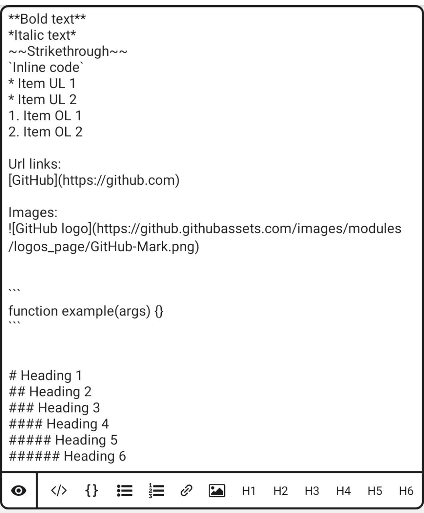
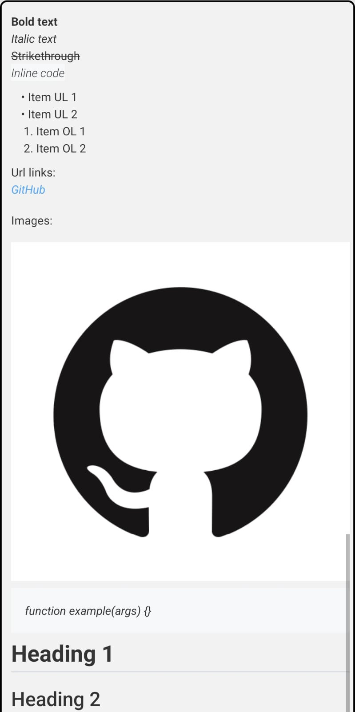

# React Native Markdown Editor <a href="https://badge.fury.io/js/@matheuswr89%2Freact-native-markdown-editor"></a> [](https://snyk.io/test/github/matheuswr89/react-native-markdown-editor)

This is a library for rendering a markdown editor for the markdown with helper buttons to easily write markdown. With live preview markdown as well (thanks to https://github.com/Benjamin-Dobell/react-native-markdown-view)

## Index

- [Getting started](#getting-started)
- [Screenshots](#screenshots)
- [Features](#features)
- [Usage](#usage)
- [Customizing](#Customizing)
  - [Customize the styles](#customize-the-styles)
- [Props for the Markdown Editor](#props)
- [Contributing](#contributing)

## Getting Started

Install the node module:

    yarn add @matheuswr89/react-native-markdown-editor

or with npm:

    npm install --save @matheuswr89/react-native-markdown-editor

Then see [Usage](#usage) for futher details

## Screenshots

Screenshot:

<div>
  
  
</div>
## Features

- Multiline textinput for writing markdown
- Live preview of the markdown written (can be hidden)
- Helper buttons to write the syntax for the markdown (like github)

<details>
  <summary>Markdown where editor helps (in order for the default format)</summary>
<p>

**Bold Text**

_Italic Text_

**Underline text**

~~Strikethrough~~

`Inline code`

- Item 1
- Item 2

1. Item 1
2. Item 2

Url Links:

[GitHub](http://github.com)

Images:


```
function codeExample(arg) {
}
```

# This is an < h1 > tag

</p>
</details>

## Usage

Import the editor through

`import { MarkdownEditor } from '@matheuswr89/react-native-markdown-editor';`

And use like this this in the jsx

`<MarkdownEditor />`

And pass a function `onMarkdownChange` which will be callback when markdown is changed

```
 <MarkdownEditor onMarkdownChange={onTextChange} />
```

It can be used with a toolbar and have a submit menu option there!

To set a content in the editor, just pass the content in the props `markdown` like this:

```
 <MarkdownEditor onMarkdownChange={onTextChange} markdown={yourVariable} />
```

## Customizing

#### Customize the styles

You can customize the styles of the following elements:

- Placeholder color | placeholderTextColor
- Text input | textInputStyles
- Helper buttons | buttonStyles
- Container of helper buttons | buttonContainerStyles
- Container of preview | markdownViewStyles

And you can do this by passing a props as below:

```
 <MarkdownEditor placeholderTextColor={yourVariableStylesHere} />
```

or:

```
 <MarkdownEditor placeholderTextColor={{yourStylesHere}} />
```

## Props

| Name                  | Type       |   Default   | Description                                     | Required |
| :-------------------- | :--------- | :---------: | ----------------------------------------------- | -------- |
| onMarkdownChange      | function   |             | Callback function, calls when markdown is typed | True     |
| placeholder           | string     | "Type here" | Text of placeholder of the input                | False    |
| markdown              | string     |     ""      | Content of editor                               | False    |
| placeholderTextColor  | string     |   "#000"    | Color of the placeholder                        | False    |
| buttonStyles          | StyleSheet |             | Action button styles                            | False    |
| buttonContainerStyles | StyleSheet |             | Action button container styles                  | False    |
| textInputStyles       | StyleSheet |             | Text input style                                | False    |
| markdownViewStyles    | StyleSheet |             | Markdown preview style (limited)                | False    |

## Contributing

PR's/Issues/Bugs or suggestions are welcomed. Please post them at https://github.com/matheuswr89/react-native-markdown-editor/issues.

## License

The MIT License.

[See LICENSE](LICENSE.md)
